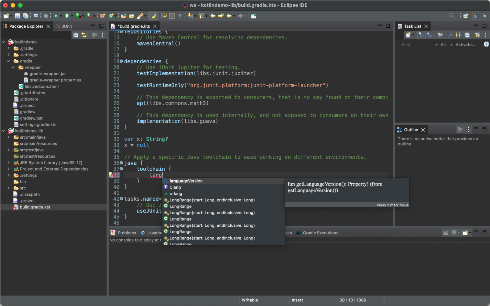
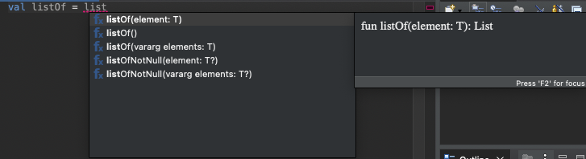
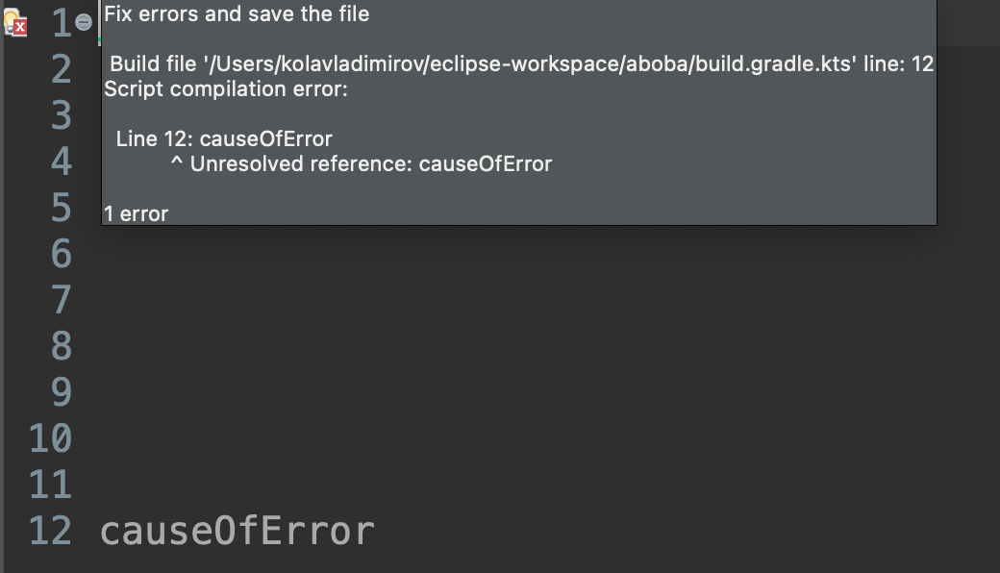
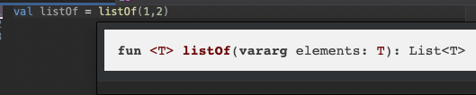
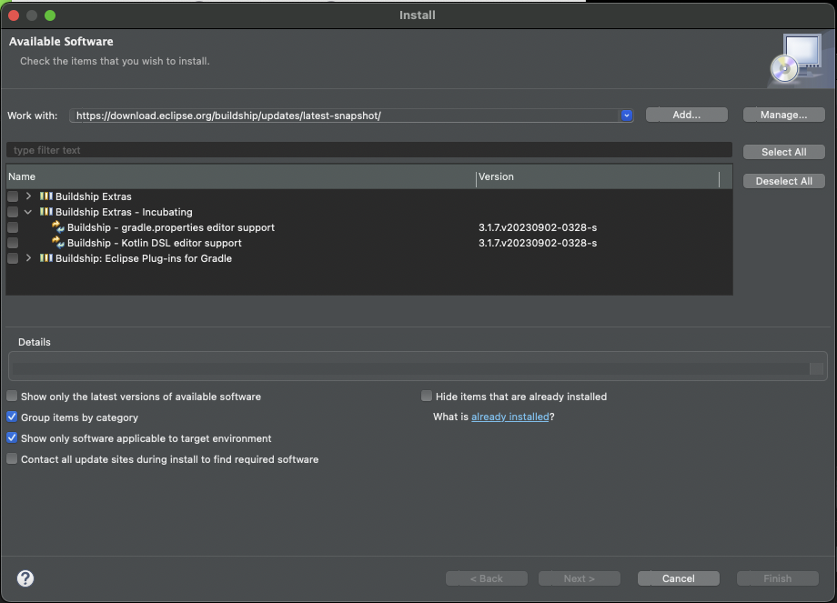

The Kotlin Foundation sponsored 4 projects for the Google Summer of Code 2023, and we are excited to announce the completion of the Eclipse Gradle Kotlin Script Support project! Gradle, a Kotlin Foundation member, provided mentoring support for this project, and we'd like to share details about the project.

The contributor to this project was [Nikolai Vladimirov](https://www.linkedin.com/in/vladimir0v/), a third-year student from Constructor University, and the mentor was [Donát Csikós](https://github.com/donat), a Senior Software Engineer at Gradle. The project aimed to bring support for Gradle Kotlin Scripts (`.kts`) to the Eclipse IDE.

The initial goal was to improve user interaction with Gradle Kotlin scripts inside the Eclipse IDE. The goal was to implement the following functionality:

* Syntax highlighting for Kotlin scripts
* Content assistance
* Go-to-definition
* Accurate diagnostics for syntax errors
* Signature help
* Hovering

Nikolai successfully delivered these features by implementing support for Kotlin scripts based on the existing kotlin-language-server project, creating a new system to separate compilation environments for each build script. Here are examples of each feature:

**Syntax highlighting for .kts scripts**

**Content assistance**

**Go-to-definition**

**Accurate Diagnostics for syntax errors**

**Signature help**

**Hovering**

## Installation

The new features are not yet production-ready, and it currently does not work on Windows. Consequently, they are delivered as optional installables. You can find them in the [latest update sites](https://download.eclipse.org/buildship/updates/latest-snapshot/) under the **Buildship Extras - Incubating category**.

## Next Steps

If you'd like to get involved with improving the Eclipse Kotlin Gradle Script support, there are two parts:

* **Eclipse plugin**: The plugin is part of the [Buildship](https://github.com/eclipse/buildship) project. The implementation is in the `org.eclipse.buildship.kotlindsl.provider` subproject.
* **Language server**: The IDE-agnostic components are implemented in [this repository](https://github.com/D0zee/language-server-for-KTS-scripts/tree/GSoC-work) in the GSoC-work branch.

The remaining tasks are to add a couple of minor features and incrementally improve the reliability, stability, and performance of this plugin.

We are grateful for Nikolai and Donát's contributions to making Kotlin better for developers!
