The Kotlin Foundation sponsored four projects for Google Summer of Code 2023, and we are excited to announce the completion of the Parallel Stacks for Kotlin Coroutines in the Debugger project, for which Google, a Kotlin Foundation member, provided mentoring support. Today we'd like to share the details of the project with you.

The primary contributor to this project was [Raehat Singh Nanda](https://www.linkedin.com/in/raehat-singh-nanda-b29085201/), a computer science undergraduate, mentored by Nikita Nazarov, Kotlin Compiler Engineer on the Android team at Google. The project aimed to provide a visual way to debug applications using multiple coroutines.

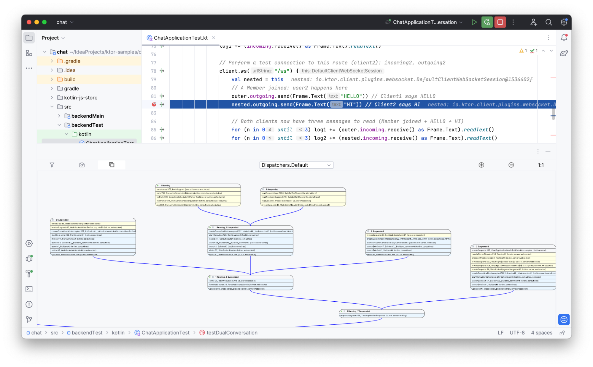

## Project Goals

While coroutines streamline asynchronous coding, debugging multiple coroutines can pose challenges, especially in large-scale applications. IntelliJ IDEA's Coroutines tab provides the ability to visualize coroutines, but it doesn't provide functionality to understand the connections between different but related coroutines.

The new Coroutine Stacks IntelliJ IDEA plugin provides a graphical depiction of numerous coroutines in specific application states. This innovation draws inspiration from the Parallel Stacks feature found in established IDEs such as JetBrains Rider, JetBrains CLion, and Microsoft Visual Studio.

Upon initiating the IntelliJ IDEA debugger and encountering a breakpoint, an application enters a suspended state. Then, the Coroutine Stacks panel displays a parallel stack view that facilitates in-depth analysis for debugging purposes.

## Coroutine Stacks

Consider the following code sample with multiple coroutines:

```kotlin
import kotlinx.coroutines.*

fun main() = runBlocking<Unit> {
    launch {
        withContext(Dispatchers.Default) {
            println()
            delay(1000)
        }
    }
    
    
    launch {
        withContext(Dispatchers.Default) {
            println()
            delay(1000)
        }
    }
}
```

Let’s add a breakpoint on the following line:

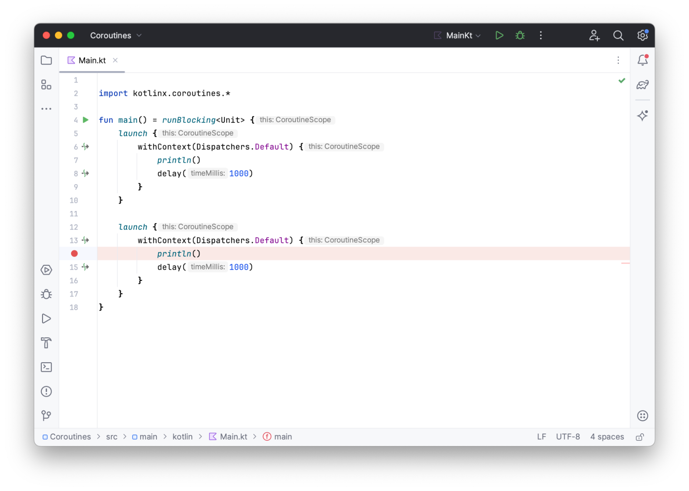

To open the **Coroutine Stacks** panel, click in the bottom right-hand corner of your main IDE panel:

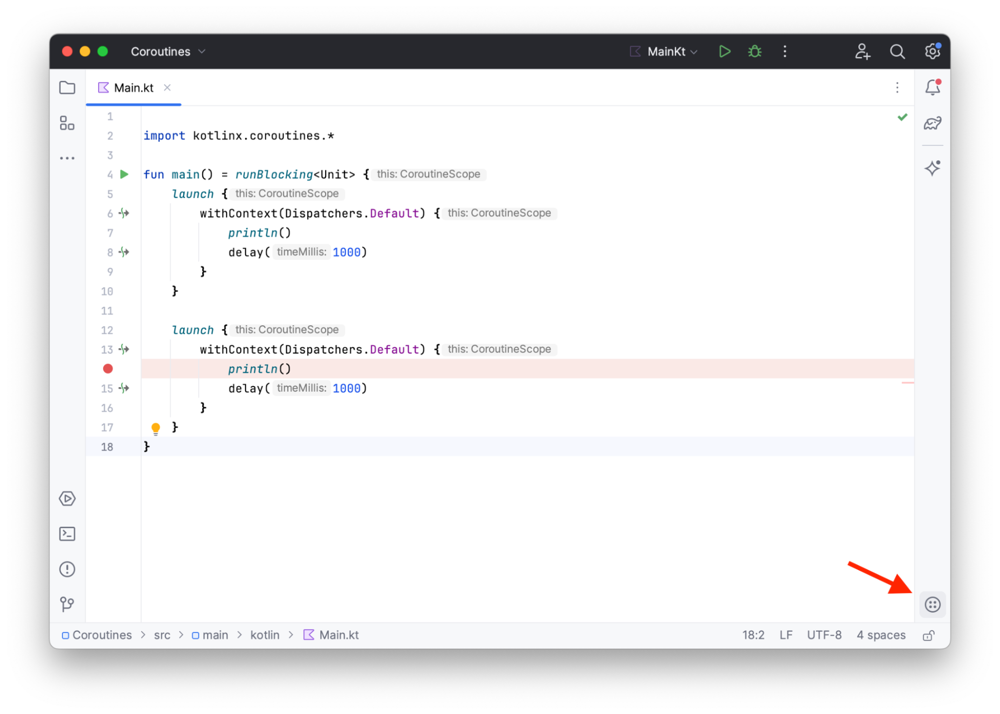

After the debugger stops at the breakpoint and opens the panel, you will see something like this:

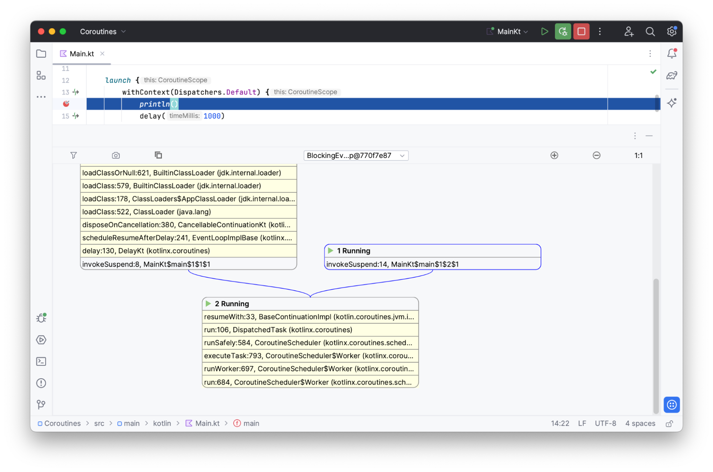

The **Coroutine Stacks** panel shows a graphical representation of different stack traces from different coroutines.

From the image above, it is clear that there are two coroutines in the application. Their stack traces share a number of frames up until resumeWith. After that, the control flow of these coroutines diverges. The stack trace with the blue border refers to the coroutine that contains the current breakpoint. The frames highlighted in yellow come from libraries. You can hide library frames by clicking the filter button:

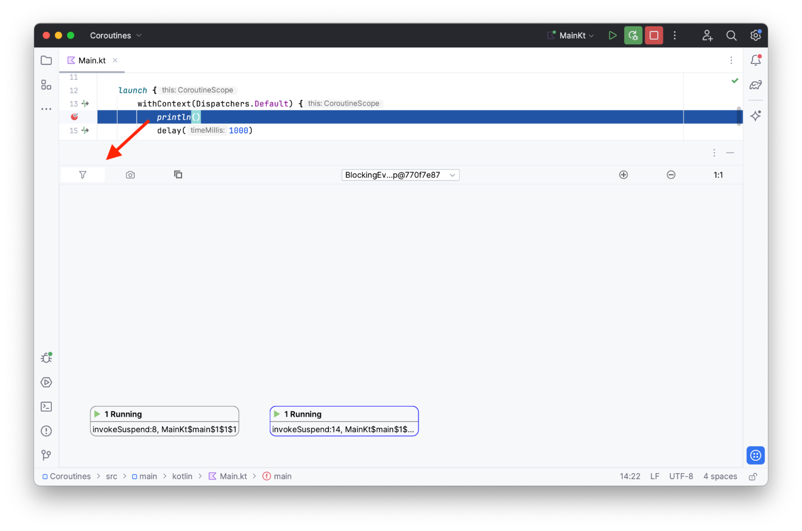

Now you can see that the stack traces of the two running coroutines only have library frames in common.

In the example, all coroutines are running on the same dispatcher, but you can switch the dispatcher by using the dropdown menu at the top of the panel:

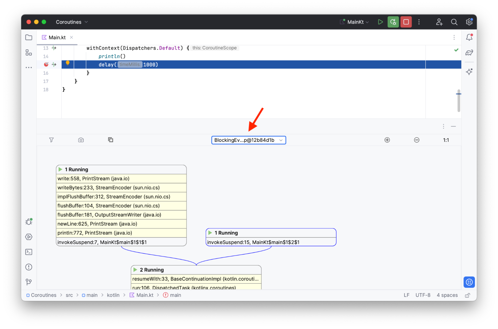

Use the minus button to zoom out. You can return to normal size by clicking the plus or the 1:1 button:

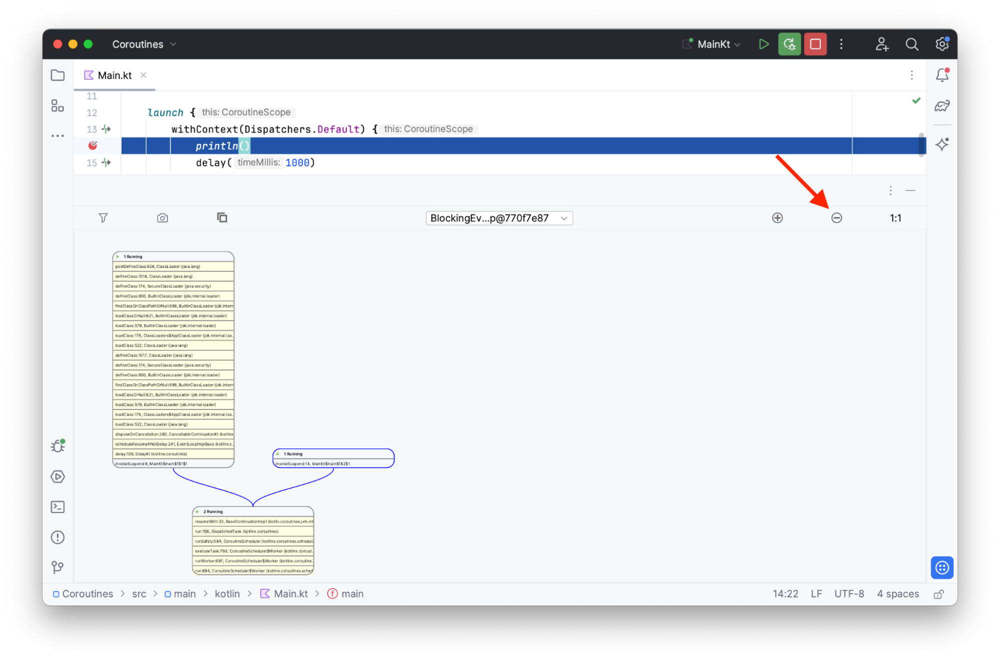

You can also add coroutine creation frames by clicking this button:

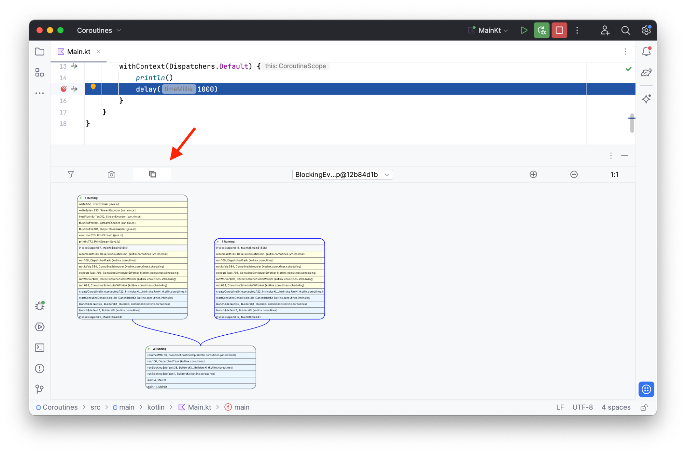

The creation frames are highlighted in blue. For more complex examples, the coroutine trace graph can change dramatically after the creation frames are added.

Click the photo button to capture a coroutine dump:

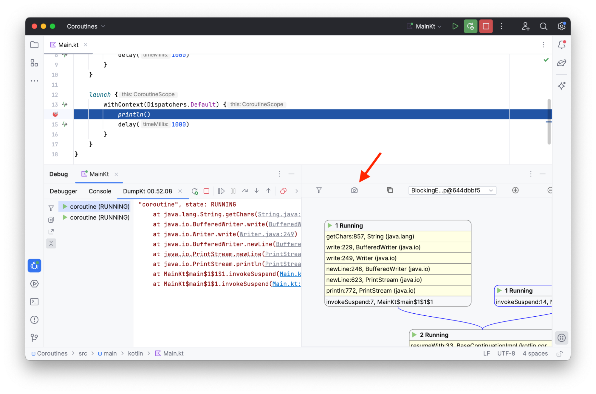

You can click on the frames to navigate to the corresponding source code position:

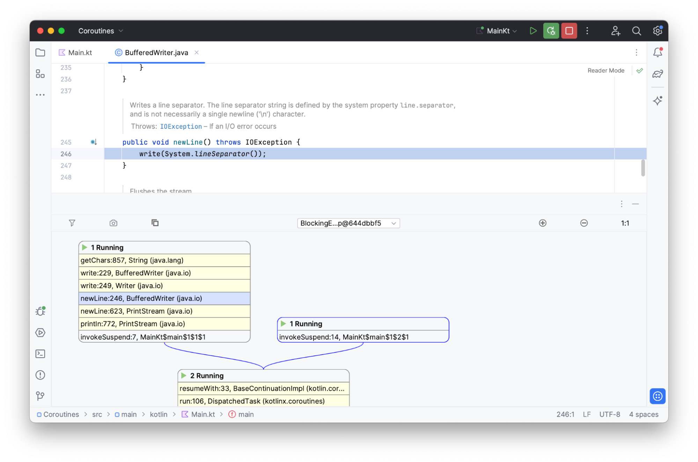

## Installation

1. Go to **Settings / Preferences** | **Plugins** in IntelliJ IDEA.
2. Switch to **Marketplace** and search for **Coroutine Stacks**:

   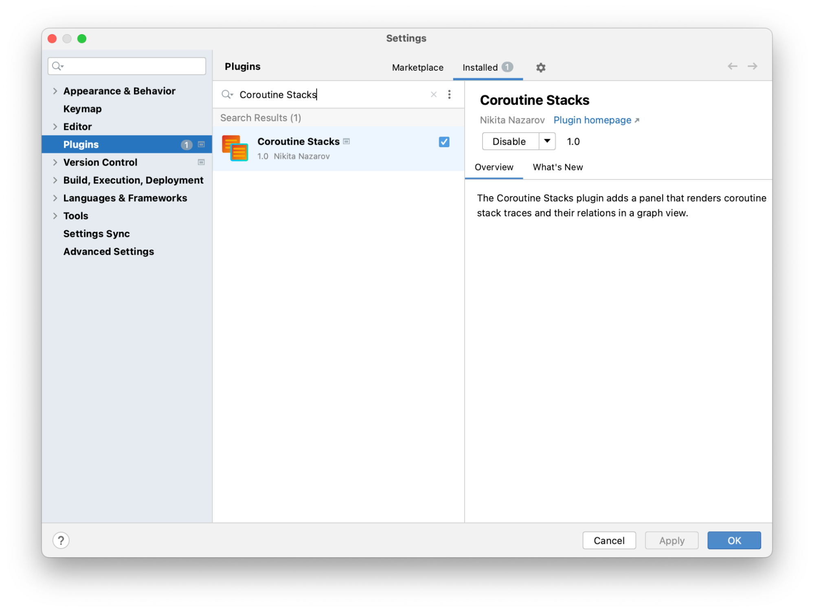
   
3. Select the plugin and click **Install**.
4. After the installation has been completed, restart the IDE.

## Feel Free to Contribute!

This is just the beginning! With new ideas and features, we can improve the tool to cover more use cases. If you’ve found a bug, don’t like how a feature works, or have other feedback, feel free to open an issue in our official GitHub repository: [https://github.com/nikita-nazarov/coroutine-stacks](https://github.com/nikita-nazarov/coroutine-stacks)

Thank you to Raehat and Nikita for building an awesome new tool to help developers be more productive!
