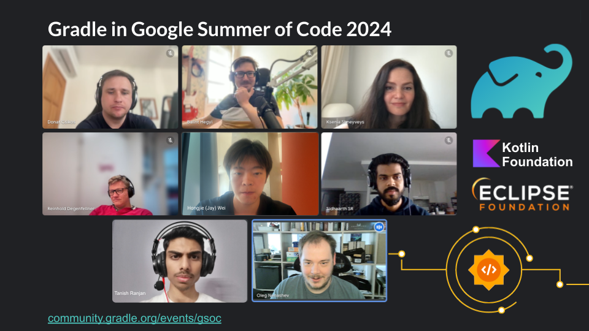
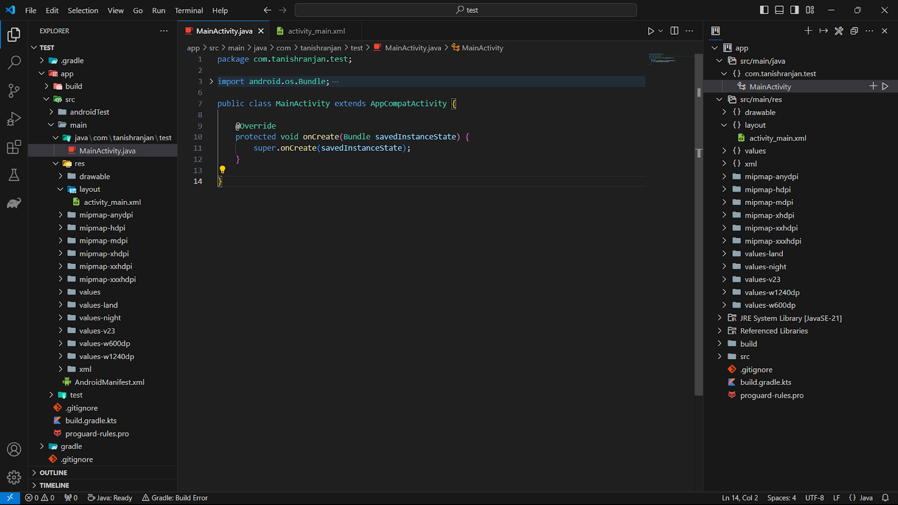

The Kotlin Foundation sponsored four projects for the [Google Summer of Code 2024](https://summerofcode.withgoogle.com/archive/2024/organizations/kotlin-foundation), and we are excited to announce the completion of the Adding Android Support to the Gradle Build Server project.

This project brought Android project support to the Gradle Build Server. Despite starting with limited Gradle API knowledge, contributor Tanish Ranjan successfully implemented features like composite build support, Java Home handling, and Android project discovery. These enhancements have been integrated into production, enriching Gradle for Kotlin/Android development.

We thank [Tanish Ranjan](https://www.linkedin.com/in/tanish-ranjan/) and the team of mentors from Gradle and Microsoft – Oleg Nenashev, Donát Csikós, Bálint Hegyi, Sheng Chen, and Reinhold – for their valuable contributions to the Kotlin and Gradle ecosystems.

Check out the [project page](https://community.gradle.org/events/gsoc/2024/gradle-build-server-android/).

## Introduction

Hi everyone, my name is [Tanish Ranjan](https://www.linkedin.com/in/tanish-ranjan/), and last year I participated in Google Summer of Code (GSoC) 2024\. I had the amazing opportunity to collaborate with folks from Gradle, Microsoft, and Google to bring [Android support to the Gradle Build Server](https://summerofcode.withgoogle.com/programs/2024/projects/Guphkt1v), under the umbrella of the Kotlin Foundation.

Today, I’m excited to share my journey – from finding out about GSoC to completing my project. If you’re considering applying for GSoC or just curious about the experience, hopefully my story will give you some insights\!

## How I discovered GSoC (Spoiler: it was last minute\!)

I’ll be honest – I had no idea what GSoC was until a friend casually mentioned it to me during a phone call. The kicker? This was just **a week before the contributor application** was set to open\!

Within that week, I dove deep into learning about GSoC – the fantastic learning experiences and career opportunities it offers. Pretty quickly, I made up my mind to get involved. I started browsing through the list of registered organizations, hoping to find a project related to **Android development**, since that’s where my skills were strongest.

A [LinkedIn post](https://www.linkedin.com/posts/androiddev_the-kotlin-foundation-is-taking-part-in-activity-7175587337827942401-gZnq?utm_source=share&utm_medium=member_desktop) caught my attention – [Android developers](https://www.linkedin.com/showcase/androiddev/) were talking about how the Kotlin Foundation was one of the organizations participating in GSoC. After going through Kotlin Foundation’s project ideas, one grabbed my attention: adding [Android support to the Gradle Build Server](https://kotlinlang.org/docs/gsoc-2024.html#gradle-build-server-support-for-android-projects-medium-or-hard-175-hrs-or-350-hrs). It sounded challenging and aligned perfectly with my skills, so I decided to go for it.

## Crafting my proposal (And why it took multiple attempts)

When the **Contributor Application Phase** began, contributors could send in up to three proposals, but I chose to focus all my energy on just one: the project with the **Kotlin Foundation**.

At this point, I reached out to the **organization admin**, which turned out to be a game-changer. They reviewed our proposals, offering feedback on what was missing. One of the most common mistakes (including mine\!) was not specifying clear **deliverables**. Everyone wrote about themselves and the project they wanted to contribute to, but we weren’t clear about what we’d actually deliver.

I had to revise my proposal twice before I was happy with it. Finally, I submitted it.

## The moment of truth: Getting accepted

On **May 1, 2024**, the accepted contributors were announced. I remember that night clearly. I was working on a freelance project when I received an email at around **11:30 pm** with the subject: “*Congratulations, your proposal with Kotlin Foundation has been accepted\!*”

I couldn’t contain my excitement – I was literally bursting with joy\! **Having just graduated high school in 2023 and not started university yet**, the opportunity to work with **industry professionals** from Google, Microsoft and Gradle felt surreal.

With my proposal accepted, I dove into researching technologies I’d need for the project, such as [**JSON-RPC**](https://www.jsonrpc.org/) and [**Build Server Protocol (BSP)**](https://build-server-protocol.github.io/docs/specification), while also setting up my work environment.

## Community Bonding Phase: Meeting the Team

The first formal step was the **Community Bonding Phase**. A meeting was organized to introduce all the mentees to the team and admins, where we discussed the projects and how to approach them and set up regular **sync-up meetings**.

This phase helped us ease into the collaboration and set the stage for the real coding to begin.

## First coding phase: Learning Gradle from scratch

When the **first coding phase** started, I was assigned my first task: adding **composite build support** to the Gradle Build Server. Here’s the catch – I had **no prior experience** with the [**Gradle API**](https://docs.gradle.org/current/javadoc/index.html) or the [**Gradle Tooling API**](https://docs.gradle.org/current/javadoc/org/gradle/tooling/package-summary.html). So far I had only skimmed the tip of the iceberg by using Gradle in building Android projects.

The first few weeks were tough, as I struggled to get up to speed. But here’s a key lesson I learned: It’s perfectly okay **not to know everything** at the start. Mentors are there to guide you, but it’s important to do your own research and tackle hurdles first. When you’re stuck, that’s when mentors step in and provide the support you need.

Once I got comfortable with the technologies and Gradle Build Server project, my work pace picked up. After completing the [**LanguageExtension downcast**](https://github.com/microsoft/build-server-for-gradle/pull/160) fix (which turned out to be a prerequisite for my first task), I tackled the [**composite builds**](https://github.com/microsoft/build-server-for-gradle/pull/154). This led to my first task being merged just in time for my **mid-term evaluation**.

## Mid-term evaluation and a new challenge

A few weeks before the **mid-term evaluation**, a new task was added to my GSoC project: **Android project discovery** for the Gradle Build Server. This was a significant addition, but I was excited for the challenge.

While the evaluations were being processed, I also started working on **Java Home Handling** in the Gradle Build Server. Juggling these tasks allowed me to stay ahead and keep making progress.

[Gradle in Google Summer of Code 2024 - Mid-Term Project Demos](https://youtu.be/UN0AFCLASZA?t=371&si=5rcmiwhqZrPN_NTb)

## Final coding phase: Tackling the hardest part

The **final coding phase** began with me completing [**Java Home Handling**](https://github.com/microsoft/build-server-for-gradle/pull/165) and submitting a pull request. However, a new update of Gradle for Java extension delayed the PR’s merge. But this delay actually worked in my favor – it gave me time to reconsider our approach to handling Java Home.

One of my mentors advised against over-engineering the implementation, as it could obscure the logic of Java Home selection and confuse users. Simplifying the approach meant reworking the implementation, but it resulted in a clearer and better experience overall. It was a win-win for the end users.

My final and most challenging task was adding [**Android project discovery**](https://github.com/microsoft/build-server-for-gradle/pull/173). This involved working with the [**AGP (Android Gradle Plugin) API**](https://developer.android.com/reference/tools/gradle-api), which had very little documentation on extracting project information for language features.

I reached out to my organization admin, and they connected me with developers from **Google** who work on **AGP**. Collaborating with them helped me extract most of the required information. For anything that the AGP API didn’t publicly expose, I found creative workarounds.

By the end, I successfully added Android project support to the Gradle Build Server\! And here’s the most exciting part: **every piece of code I wrote was integrated directly into production**. Each of my contributions was merged into the **next release of the Gradle Build Server**, meaning the work I did became part of the **official releases of** **VSCode’s [Gradle for Java](https://github.com/microsoft/vscode-gradle) extension**\!

## Wrapping up: Reflections on my GSoC experience

Completing this project was an incredibly rewarding experience. Not only did I gain technical skills, but I also learned the value of **collaboration** and **communication**, and being persistent when tackling challenging tasks.

To anyone considering GSoC, especially beginners: **go for it**\! Don’t worry if you’re not an expert – this program is all about learning. And trust me, it’ll be one of the most fulfilling experiences of your programming career.

Thanks for reading about my GSoC journey. Feel free to [drop me](https://www.linkedin.com/in/tanish-ranjan/) any questions or thoughts\! 🙂

If you’re interested in the technical details of what I contributed, be sure to check out my [**project page**](https://community.gradle.org/events/gsoc/2024/gradle-build-server-android/) for an in-depth look at my work on the [**Gradle Build Server**](https://github.com/microsoft/build-server-for-gradle).
