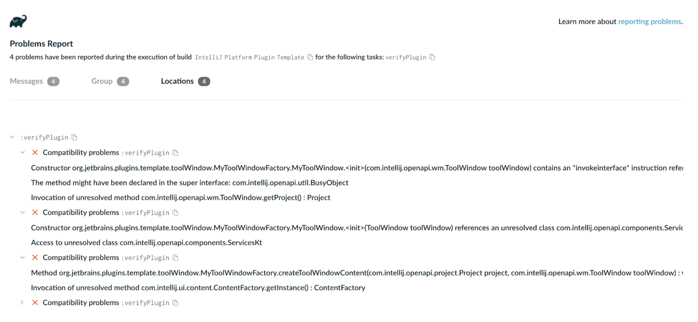
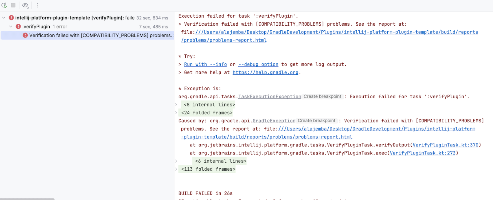

import victoriaImg from "./victoria.jpeg"

<style>{`
  .gsoc-author-card {
    display: flex;
    align-items: flex-start;
    gap: 30px;
    margin-bottom: 20px;
    @media (max-width: 472px) {
      display: block;
    }
  }
  .gsoc-author-img {
    border-radius: 50%;
    flex-shrink: 0;
    margin-top: 0;
    margin-bottom: 20px;
  }
  .gsoc-quote {
    margin: 0 0 0 10px;
  }
`}</style>

<div className="gsoc-author-card">
  

  <blockquote className="gsoc-quote">
    "GSoC was the perfect opportunity to give back to the tools I use daily and move from user to contributor because I’d already been building IntelliJ plugins myself."

    **Victoria Chuks Alajemba**
  </blockquote>
</div>

**[Project page](https://dev.to/victoria_chuks_7e772e1688/gsoc-2025-kotlin-foundation-final-report-3p4c)**

**Mentor:** Jakub Chrzanowski (JetBrains)

For Victoria Alajemba, a Software Engineer from Nigeria studying in Paris, GSoC was a bridge between learning and impact. Working on the IntelliJ Platform Gradle Plugin, she integrated Gradle’s Problems API and Reporting API, creating richer, standardized reports and exploring parallel verification for faster builds. Guided by Jakub Chrzanowski from JetBrains, she strengthened key workflows used by thousands of plugin developers.

## About the author

I am Victoria Chuks Alajemba, a software engineer passionate about developer tooling from Nigeria. I’ve been building mobile applications professionally since 2021, after learning programming via YouTube in 2020, and I am currently exploring the world of plugins and extensions across several platforms like the IntelliJ Platform, VS Code, Chrome, and more. I love developer tools and programming in general, but more than that, I love the idea of being able to create something that solves a problem. I currently study artificial intelligence and data science for businesses at aivancity School of AI & Data for Business & Technology in Paris.

## Intro and motivation

### Why this project matters

The IntelliJ Platform Gradle Plugin is a critical tool for developers building plugins that target the IntelliJ Platform. It is used by JetBrains and third-party developers to build, test, verify, and publish their plugins. Improvements to this tool will ensure that the thousands of developers who rely on it have a great experience.

### The problem it solves

The verifyPlugin task, a Gradle task that is part of the IntelliJ Platform Gradle Plugin, enables developers to check that their plugin works against various IntelliJ-based IDEs (PyCharm, Android Studio, IntelliJ IDEA Community Edition, and more). However, the IntelliJ Platform Gradle Plugin team had identified certain areas for enhancement:

1. **Non-standard reporting:** The verifyPlugin task used its own custom reporting system rather than Gradle's Reporting API, making reports less configurable and harder to integrate with standard Gradle workflows.  
2. **Limited error context:** Build issues that were reported could benefit from a more detailed and structured process with the Problems API.  
3. **Unclear performance characteristics:** We needed to investigate whether parallel execution could speed up verification against multiple IDE versions.  
   

## Technical highlights

### Core technical achievements

#### Gradle Problems API integration  ✅ Merged [PR \#1987](https://github.com/JetBrains/intellij-platform-gradle-plugin/pull/1987)

* Replaced ad-hoc error reporting in VerifyPluginTask with Gradle's structured Problems API.  
* Enhanced error reporting with contextual details, file locations, suggested solutions, and documentation links.

#### Gradle Reporting API integration ✅ Merged [PR \#2016](https://github.com/JetBrains/intellij-platform-gradle-plugin/pull/2016)

* Implemented VerifyPluginConfigurationReportsImpl with ReportContainer\<SingleFileReport\> for standardized reporting.  
* Added TXT report support with configurable output locations via the Gradle DSL.  
* Integrated the Reporting\<VerifyPluginConfigurationReports\> interface for task-level report configuration.  
* Demonstrated successful Reporting API usage in simpler validation contexts.

#### Gradle Reporting API for VerifyPluginTask 🔄 [Draft PR \#1996](https://github.com/JetBrains/intellij-platform-gradle-plugin/pull/1996)

* Implemented ReportingContainer supporting HTML, Markdown, and plain text reports.  
* Exposed configuration through IntelliJPlatformExtension for user customization.  
* Blocked by IntelliJ Plugin Verifier's single output directory limitation.

#### Parallel verification research 🔍 [Closed PR \#1948](https://github.com/JetBrains/intellij-platform-gradle-plugin/pull/1948)

* Prototyped a Gradle Worker API for concurrent verifyPlugin execution against multiple IDE versions.  
* Discovered IntelliJ Plugin Verifier already uses internal ExecutorService concurrency.  
* Identified the true bottleneck: sequential IDE dependency downloads (not verification).  
* Researched dependency substitution, a ResolutionResult API, and parallel resolution strategies.

#### Gradle Cookbook documentation ✅ [Merged PR \#58](https://github.com/gradle/cookbook/pull/58)

* Authored a practical guide on wiring the Reporting API into plugin tasks.  
* Provided configuration examples and best practices for plugin developers.


### Features, architecture, and key gains

#### Key features

* **Structured problem reporting**: Consistent issue visualization across IDEs, consoles, and BuildScans.  
* **Configurable reports**: DSL-based report format and location customization.  
* **Rich error context**: File locations, documentation links, and suggested solutions.  
* **Gradle ecosystem alignment**: Leverages Problems API (Gradle 8.6+) and Reporting API standards.

#### Architecture

##### Problems API architecture

* **Problems.kt**: Centralized registry of `ProblemIds` organized by:   
  * `ProblemGroups  
    Groups.VerifyPlugin` for verification-specific issues.  
  * Dynamic `VerificationFailure` factory generating `ProblemIds` from `FailureLevel` enum.

```
/**
 * Contains problem IDs to be used when reporting a problem with the Problems API
 * for the IntelliJ Platform Gradle Plugin.
 *
 * @see org.gradle.api.problems.ProblemId
 * @see org.gradle.api.problems.Problems
 */
@Suppress("UnstableApiUsage")
internal object Problems {

    /**
     * Contains [ProblemGroup]s to be used with the Problems API for the IntelliJ Platform Gradle Plugin.
     */
    private object Groups {
        val IntelliJPlatformPlugin = ProblemGroup.create(
            "intellij-platform-plugin-group",
            "IntelliJ Platform Plugin Problems"
        )

        val VerifyPlugin = ProblemGroup.create("$ID.verify-plugin", "Verify Plugin")
    }

    object VerifyPlugin {
        val InvalidPlugin = ProblemId.create(
            "invalid-plugin",
            "Invalid Plugin",
            Groups.VerifyPlugin,
        )
        // ....
    }
}
```

* **`reportError()` helper**: Wraps exceptions with Problems API metadata, including clickable report URLs.

```
/**
 * Helper function to report an error using the Problems API.
 *
 * @param exception The exception to report. It is suppressed to allow a wrapper exception be thrown with an updated message.
 * @param problemId The ID of the problem to report.
 * @param problemsReportUrl Optional URL used to include the report file's path to the exception's message.
 * Expected value: [org.gradle.api.file.ProjectLayout.getBuildDirectory]/reports/problems/problems-report.html
 * @param spec An action that further configures the problem specification.
 * @return A RuntimeException that includes the original exception and the problem details.
 */
internal fun ProblemReporter.reportError(
    exception: Exception,
    problemId: ProblemId,
    problemsReportUrl: String?,
    spec: Action<ProblemSpec>
): RuntimeException {

    val message = buildString {
        append(exception.message)
        if (problemsReportUrl != null) {
            append("${System.lineSeparator()}[Incubating] See full report here: $problemsReportUrl")
        }
    }

    return throwing(RuntimeException(message).also { it.addSuppressed(exception) }, problemId) {
        spec.execute(this)

        withException(exception)
        severity(Severity.ERROR)
    }
}
```

* **Output parsing pipeline**: `collectProblems()` → `parseItemsToMap()` → structured `ProblemSpec` generation.  
* **Severity mapping**: `FailureLevel` enum values map to `Severity.ERROR/WARNING` based on configuration.

**Sample in BuildScan:**



**In-IDE sample:**



##### Reporting API architecture

* **`VerifyPluginConfigurationReportsImpl`**: `DelegatingReportContainer` delegating to `DefaultReportContainer`. 

```
open class VerifyPluginConfigurationReportsImpl @Inject constructor(
    owner: Describable,
    objectFactory: ObjectFactory,
) : DelegatingReportContainer<SingleFileReport>(
    DefaultReportContainer.create(
        objectFactory,
        SingleFileReport::class.java
    ) { factory ->
        val list: Collection<SingleFileReport> = ImmutableList.of(
            factory.instantiateReport(DefaultSingleFileReport::class.java, "txt", owner)
        )

        list
    }

), VerifyPluginConfigurationReports {

    override val txt: SingleFileReport
        get() = getByName("txt")
}
```

* **Report lifecycle**: Task execution → validation results → `SingleFileReport` generation → configurable output.  
* **DSL integration**

```
// Task DSL configuration
reports {
    txt.required.set(true)
    txt.outputLocation.convention(
        project.layout.buildDirectory.file("reports/verifyPluginConfiguration/report.txt")
    )
}
```

* **Dependency injection**: `@Inject ObjectFactory` for report instance creation.

```
@CacheableTask
abstract class VerifyPluginProjectConfigurationTask : DefaultTask(), IntelliJPlatformVersionAware, KotlinMetadataAware,
    RuntimeAware, PluginAware, ModuleAware, Reporting<VerifyPluginConfigurationReports> {

    /**
     * Service for creating custom Gradle types
     */
    @get:Inject
    abstract val objectFactory: ObjectFactory

    …
    /**
     * Container for results generated from verifying the plugin's project configuration.
     *
     * Output location is configured using [org.gradle.api.reporting.internal.DefaultSingleFileReport.getOutputLocation].
     * Default value: [org.gradle.api.file.ProjectLayout.getBuildDirectory]/reports/verifyPluginConfiguration/report.txt
     */
    private val reports: VerifyPluginConfigurationReports = objectFactory.newInstance(
        VerifyPluginConfigurationReportsImpl::class.java,
        Describables.quoted("Task", identityPath)
    )

    private val txtReportFile get() = if (reports.txt.required.get()) reports.txt.outputLocation else null

    ...
}
```

#### Key gains

* **Developer experience**: Rich, actionable error messages replace verbose exceptions.  
* **Maintainability**: Centralized problem definitions and standardized reporting.  
* **Performance insights**: Identified dependency resolution as the primary bottleneck.  
* **Gradle compliance**: Aligns IPGP with modern Gradle APIs and best practices.

#### Project repository and demos

[Main repository](https://github.com/JetBrains/intellij-platform-gradle-plugin)

[Mid-term progress demo](https://drive.google.com/file/d/1UMafS4ItXTdMWMpH6bdkXrF90dwuXu-8/view)

## About my GSoC experience

### How I discovered GSoC

I've been using Kotlin since I started programming about four years ago through Android development. Contributing to Kotlin has been on my mind for a while, but the main Kotlin repository seemed daunting to dive into. When I discovered Google Summer of Code, it felt like the perfect structured opportunity to finally contribute meaningfully to the Kotlin ecosystem.

The IntelliJ Platform Gradle Plugin project immediately caught my attention because I'd already been building IntelliJ Platform plugins myself. I had even [documented my migration experience to the new IntelliJ Platform Gradle Plugin](https://dev.to/victoria_chuks_7e772e1688/gsoc-2025-kotlin-foundation-final-report-3p4c), which gave me some familiarity with the tool's API. At my core, I see myself as more of a user than just a developer, so I'm passionate about improving the tools I actually use daily.

### How I created the successful proposal

Creating my proposal was an intensive research process that took several weeks, and here's how I approached it:

#### Communicating with the organization

While putting together my proposal, I made sure to ask questions about it on the org’s Slack channel. Doing this demonstrated my dedication and the kind of insight I already had for the project.

#### Understanding the codebase (3–4 weeks before the proposal deadline)

I dived into the IntelliJ Platform Gradle Plugin source code, focusing on the key parts outlined in the project description:

* I focused on VerifyPluginTask and discovered it extends JavaExec and delegates to the Verifier CLI.  
* I found the TODOs in the codebase that specifically mentioned Worker API and Reporting API integration – these became my project's foundation.  
* I examined how VerifyPluginTask calls the external tool in its exec() method:

```
@TaskAction
override fun exec() {
    with(ides) {
        ...
        args(listOf("check-plugin")...)
        ...
        ByteArrayOutputStream().use { os ->
            super.exec()
        }
        ...
    }
}
```

* I analyzed the IntelliJ Plugin Verifier tool itself, discovering that it already implements parallelization using `ExecutorService` in `com.jetbrains.pluginverifier.runSeveralVerifiers`.

#### Learning from other plugins (2–3 weeks before the deadline)

I researched similar implementations in the Gradle ecosystem:

* **For the Worker API:** I studied paperweight, Kotlin Benchmark, compose-multiplatform-core, and spotbugs-gradle-plugin to understand Worker API patterns and best practices.  
* **For the Reporting API:** I examined Teamscale Gradle Plugin, inspection-plugin, and spotbugs-gradle-plugin to see how they implemented custom reports.

#### Building a proof-of-concept (2 weeks before the deadline)

I also built prototypes:

1. **Reporting API prototype:** I created a working implementation on VerifyPluginProjectConfigurationTask (a simpler task that handles its own reporting). This proved that Gradle Reporting API integration was feasible and showed I understood the technical challenges.

2. **Worker API prototype:** I implemented a basic Worker API integration for VerifyPluginTask using process isolation mode:

```
abstract class VerifyPluginTask : DefaultTask() {
    @get:Inject
    abstract val workerExecutor: WorkerExecutor
    
    @TaskAction
    fun verifyAction() {
        val workQueue = workerExecutor.processIsolation()
        workQueue.submit(VerificationTaskWork::class.java) {
            // Set parameters for isolated execution
        }
    }
}
```

[Full implementation available here](https://github.com/alajemba-vik/intellij-platform-gradle-plugin/commit/6fbc444caf66481c8058c6e947874842ffd7f3e0).

#### Identifying risks honestly

I identified potential blockers:

1. **Worker API risk:** Process isolation might introduce performance overhead that needs extensive testing.  
2. **Reporting API challenge:** Since `VerifyPluginTask` delegates reporting to the Verifier CLI, we might need to update the CLI to output `List\<PluginVerificationResult\>` differently.  
3. **External dependency concern:** IntelliJ Plugin Verifier is used by JetBrains Marketplace and external tools like GitHub Actions, so changes need careful consideration.

Being upfront about these risks showed I understood the complexity, not just the ideal outcomes.

#### Creating a realistic timeline

I broke down my timeline into specific, measurable tasks:

* **Before May 8:** Research and documentation study.  
* **Before June 2:** Codebase analysis and prototype refinement.  
* **June 1 – July 13:** Implementation with unit and integration tests.  
* **July 14 – August 25:** Performance benchmarks, documentation, and finalization.  
* **Plus:** A 3-week buffer for unpredictable delays.

#### Being authentic about my experience level

I was honest about my situation and experience:

* I found large codebases like the main Kotlin repository daunting.  
* I saw GSoC as an opportunity to learn how to become a better open-source contributor.  
* I also acknowledged a personal constraint: I'd be starting my first year at aivancity School of AI & Data for Business & Society in September, so I planned to complete the coding portion before then.

I also highlighted relevant experience:

* Building IntelliJ Platform plugins (Flutter Image Icons, PokéPop).  
* Contributing to Jetpack Compose Samples and kotlin-web-site.  
* Documenting my migration to IPGP, showing I understand user experience.


### What I think made my proposal stand out:

1. **Working prototypes:** I showed that I could execute the core ideas proposed.  
2. **Deep technical understanding:** I demonstrated knowledge of the codebase architecture.  
3. **Honest risk assessment:** I identified blockers and dependencies upfront.  
4. **Realistic timeline:** My schedule was detailed and included buffers.  
5. **User-focused motivation:** I emphasized improving tools I actually use, showing genuine investment.  
   

### Lessons from the proposal process:

* **Spend enough time on your proposal:** I dedicated a total of over 96 hours to putting together my proposal, allowing me to deep dive into different areas.  
* **Build something:** Even a small prototype demonstrates capability better than any written description.  
* **Ask questions:** I reached out on Slack to understand the project scope before finalizing my proposal.  
* **Be honest:** Acknowledging what you don't know yet is more valuable than pretending to know everything.  
* **Show, don't tell:** Code snippets and concrete examples made my proposal tangible.

Looking back, the time I invested in understanding the architecture and building prototypes was crucial. It gave me confidence in what I proposed and helped me hit the ground running when the program started.

## Resources

* [Google Summer of Code 2025 Final Report (Kotlin Foundation)](https://dev.to/victoria_chuks_7e772e1688/gsoc-2025-kotlin-foundation-final-report-3p4c)  
* [IntelliJ Platform Gradle Plugin repository](https://github.com/JetBrains/intellij-platform-gradle-plugin)  
* [Slack channel](https://slack-chats.kotlinlang.org/c/gsoc)  
* [IntelliJ Platform Plugin SDK](https://plugins.jetbrains.com/docs/intellij/welcome.html)

**My contributions:**

* [Problems API integration (Merged) \#1987](https://github.com/JetBrains/intellij-platform-gradle-plugin/pull/1987)  
* [Reporting API for VerifyPluginProjectConfigurationTask (Merged) \#2016](https://github.com/JetBrains/intellij-platform-gradle-plugin/pull/2016)  
* [Reporting API for VerifyPluginTask (Draft) \#1996](https://github.com/JetBrains/intellij-platform-gradle-plugin/pull/1996)  
* [Worker API research (Closed) \#1948](https://github.com/JetBrains/intellij-platform-gradle-plugin/pull/1948)  
* [Gradle Reporting API Cookbook (Merged) \#58](https://github.com/gradle/gradle/pull/58)


## Get in touch

I'd love to connect with fellow developers working on build tools, Gradle plugins, IntelliJ Platform development, or Kotlin, or explore any roles related to this\!

* **Email:** [alaje.vik@gmail.com](mailto:alaje.vik@gmail.com)
* **GitHub:** [github.com/alajemba-vik](https://github.com/alajemba-vik)  
* **LinkedIn:** [https://www.linkedin.com/in/alajemba/](https://www.linkedin.com/in/alajemba/)   
* **YouTube:** [https://www.youtube.com/@ChillProgramming](https://www.youtube.com/@ChillProgramming)
