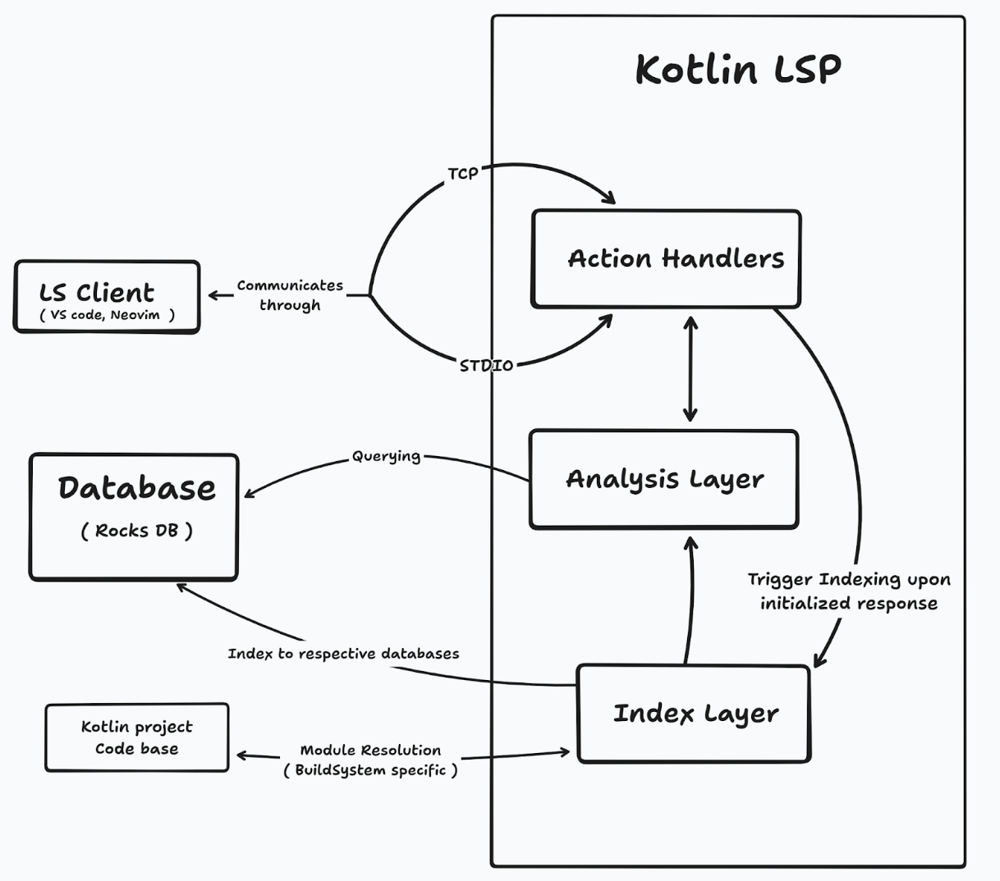

import hemramImg from "./hemram.jpg"

  

  <blockquote className="gsoc-quote">
    "It was incredibly rewarding to see my work tested, reviewed, and used by others in the community."

    **Hemram**
  </blockquote>

**[Project page](https://github.com/h4-mm-3r/kotlin-lsp)**

**Mentors**: Shauvik Roy Choudhary, Ryan U, Michael Noah, Claudia Babescu (all from Uber)

From picking up Kotlin from scratch to building a compiler-integrated Language Server with the new Analysis API, Hemram’s project expanded the boundaries of Kotlin tooling. 

Working with mentors from Uber and the Kotlin Foundation, he delivered a modern, open foundation for editor integrations and future AI-assisted tools for the Kotlin Language Server Protocol.

## About the author

Hi, I’m Hemram, a developer from Bangalore, India, passionate about developer tooling and compiler technologies. 

## Intro and motivation

I’ve always been curious about how Language Server Protocols (LSPs) work behind the scenes. When I came across this project idea during Google Summer of Code 2025, it immediately caught my interest. 

During that time, I was exploring kotlin-language-server, which is an open-source Kotlin LSP using `kotlinc` under the hood. I had experienced some bottlenecks and understood what the community wanted. On researching further, I found out about the Kotlin Analysis API, which is a better way to communicate with the K2 compiler compared to the inefficient `kotlinc`. This formed the base of my proposal for this LSP project. 

## Technical Highlights

The project involved designing a new Language Server Protocol (LSP) implementation based on version 3.17 of the spec.

### Key components:

* **Kotlin Analysis API** – leveraged for semantic analysis and compiler-backed insights.  
* **LSP4J** – the Java framework used for implementing the LSP specification.  
* **RocksDB** – integrated as a persistent key-value store for efficient codebase indexing and symbol resolution.

### Core features implemented:

* Project handling for the Gradle build system (single and multi-module for both Vanilla and Android)  
* *Go to Definition*  
* *Go to Implementation*  
* *Go to Reference*  
* *Rename* refactoring  
* Document symbols  
* Semantic highlighting  
* Hover (with KDoc and JavaDoc-based descriptions).  
* Generic, import, and package-based code completion.

[RoadMap](https://github.com/H4-MM-3R/kotlin-lsp/blob/main/docs/roadmap.md)

### High-level overview

## About my GSoC experience

It was an exciting period working under the Kotlin Foundation, building a Kotlin language server.

I first heard about GSoC a few years ago and always admired how contributors made a real impact in open-source ecosystems. This year, I finally took the leap, and it’s been a rewarding experience from start to finish.

There were some challenges along the way, like when the official Kotlin LSP was announced at KotlinConf 2025\. As it was in the pre-alpha stage, I had to fork an incomplete project and contribute to GSoC on the basis of that. Beyond that, the journey was pretty smooth, with the completion of the Kotlin LSP as an MVP.

## What I learned

As it was the starting point of my open-source journey, I learned about how real collaboration happens, from writing clear commits and discussing design choices to adapting when project goals shift.

One of the biggest takeaways from my GSoC journey was stepping out of my comfort zone and realizing how much it stretched my learning curve. I had to pick up Kotlin from scratch, explore the Analysis API, and work across multiple tools and environments. It was also incredibly rewarding to see my work tested, reviewed, and used by others in the community.

## Resources

* [Project Page](https://summerofcode.withgoogle.com/programs/2025/projects/Y8cK79RJ)
* [GitHub Repo](https://github.com/h4-mm-3r/kotlin-lsp)

## Contacts

* [LinkedIn](https://www.linkedin.com/in/hemram-kumarapu/)
* [GitHub](https://github.com/h4-mm-3r)
* Email: [kuheram777@gmail.com](mailto:kuheram777@gmail.com)
